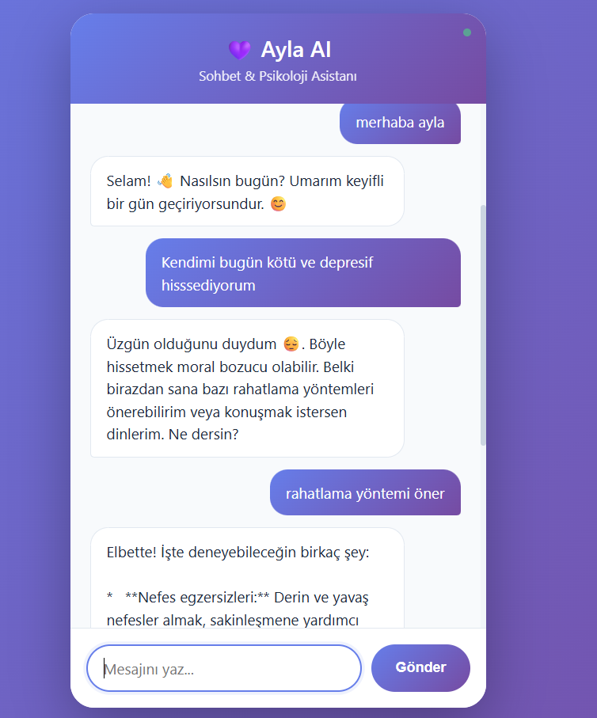

# 💜 AYLA AI - Gelişmiş Sohbet & Psikoloji Asistanı

Bu proje, **Akbank GenAI Bootcamp: Yeni Nesil Proje Kampı** kapsamında geliştirilmiş, RAG (Retrieval Augmented Generation)  tabanlı bir sohbet asistanıdır.

---

## 1. Projenin Amacı 

Projenin temel amacı, kullanıcılara psikoloji, Bilişsel Davranışçı Terapi (BDT) ve mindfulness (farkındalık) konularında uzmanlaşmış, doğru ve güvenilir bilgiler sunabilen bir yapay zeka asistanı oluşturmaktır. Genel sohbet yeteneklerine ek olarak, "Ayla" RAG mimarisi sayesinde belirli PDF dokümanlarındaki bilgileri kullanarak spesifik sorulara kaynak bazlı yanıtlar verebilir.

## 2. Veri Seti Hakkında Bilgi 

Bu proje için özel bir veri seti toplanmamıştır.Bunun yerine, asistanın uzmanlık alanı (psikoloji) için bilgi kaynağı olarak üç adet PDF dokümanı kullanılmıştır:

1.  **psikoloji_sozlugu.pdf:** Psikoloji ile ilgili temel terimleri ve tanımları içerir.
2.  **mindfulness_egzersizleri.pdf:** Farkındalık ve meditasyon egzersizleri hakkında pratik bilgiler sunar.
3.  **bdt_kilavuzu.pdf:** Bilişsel Davranışçı Terapi'nin temel prensipleri ve teknikleri hakkında bir rehberdir.

Bu dokümanlar, LangChain kütüphanesi kullanılarak işlenmiş, parçalara ayrılmış ve bir FAISS vektör veritabanına gömülmüştür.

## 3. Çözüm Mimarisi ve Kullanılan Yöntemler 

Proje, Flask tabanlı bir web sunucusu üzerinde çalışan bir RAG (Retrieval Augmented Generation) mimarisi kullanır.

**Problem:** Gemini gibi büyük dil modelleri (LLM) genel bilgiye sahip olsalar da, spesifik veya güncel (bu durumda psikolojiye özel) bilgilere sahip olmayabilirler.

**Çözüm (RAG Mimarisi):**
1.  **İndeksleme:** Proje ilk çalıştığında, `setup_vector_db` fonksiyonu PDF dosyalarını (`PyPDFLoader`) okur, metinleri parçalara ayırır (`RecursiveCharacterTextSplitter`) ve `HuggingFaceEmbeddings` (multilingual-MiniLM) kullanarak bu parçaları vektörlere dönüştürür. Bu vektörler `FAISS` veritabanına kaydedilir.
2.  **Sorgu (Query):** Kullanıcı bir mesaj gönderdiğinde (`get_context_if_relevant` fonksiyonu), mesaj önce psikoloji ile ilgili anahtar kelimeler (`psi_keywords`) için taranır.
3.  **Çekme (Retrieval):** Eğer mesaj ilgiliyse, kullanıcının sorusu bir vektöre dönüştürülür ve FAISS veritabanında en benzer (ilgili) bilgi parçaları (`similarity_search`) bulunur.
4.  **Zenginleştirme (Augmentation):** Bulunan bu ilgili PDF parçaları (context), kullanıcının orijinal mesajı ve sistem talimatı (`system` prompt) ile birleştirilir.
5.  **Üretim (Generation):** Bu zenginleştirilmiş prompt, `Gemini (gemini-2.0-flash-exp)` modeline gönderilir. Model, kendisine sağlanan bağlamı (BİLGİ BANKASI) kullanarak bir yanıt üretir[cite: 42].

**Kullanılan Teknolojiler:**
* **Generation Model:** Google Gemini (`gemini-2.0-flash-exp`) 
* **Embedding Model:** `sentence-transformers/paraphrase-multilingual-MiniLM-L12-v2` 
* **Vector Database:** `FAISS` (CPU versiyonu) 
* **RAG Pipeline:** `LangChain` (PyPDFLoader, TextSplitter), `FAISS` 
* **Web Arayüzü & Sunucu:** `Flask`

**Hata Yönetimi:**
Uygulama, Gemini API'sinden gelebilecek `503 Service Unavailable` (Aşırı Yüklenme) gibi geçici hatalara karşı dayanıklıdır. `generate_response` fonksiyonu, "Exponential Backoff" (Üstel Geri Çekilme) mekanizması sayesinde bir hata durumunda (toplam 3 kez) artan sürelerle bekleyerek isteği yeniden dener.

## 4. Çalışma Kılavuzu 

Projenin lokal makinenizde çalıştırılması için gereken adımlar:

1.  **Repoyu Klonlayın:**
    ```bash
    git clone [https://github.com/humeyraturk/AYLA-AI-Projesi.git](https://github.com/humeyraturk/AYLA-AI-Projesi.git)
    cd AYLA-AI-Projesi
    ```

2.  **Sanal Ortam (Virtual Environment) Oluşturun ve Aktif Edin:**
    ```bash
    # Windows
    python -m venv venv
    venv\Scripts\activate
    
    # macOS / Linux
    python3 -m venv venv
    source venv/bin/activate
    ```

3.  **Gereksinimleri Yükleyin:**
    `requirements.txt` dosyasındaki tüm kütüphaneleri yükleyin.
    ```bash
    pip install -r requirements.txt
    ```

4.  **.env Dosyası Oluşturun:**
    Ana proje klasöründe `.env` adında bir dosya oluşturun ve içine Google Gemini API anahtarınızı ekleyin:
    ```
    GEMINI_API_KEY=BURAYA_API_ANAHTARINIZI_YAPISTIRIN
    ```

5.  **Uygulamayı Çalıştırın:**
    ```bash
    python chatbot.py
    ```

    * **İlk Çalıştırma:** Uygulama ilk kez çalıştığında, PDF dosyalarını okuyacak, işleyecek ve `faiss_index` klasörünü oluşturacaktır. Bu işlem birkaç dakika sürebilir. Konsolda "bilgi parçası indekslendi" mesajını göreceksiniz.
    * **Sonraki Çalıştırmalar:** İkinci ve sonraki çalıştırmalarda, uygulama mevcut `faiss_index` klasörünü yükleyerek çok daha hızlı başlayacaktır.

## 5. Web Arayüzü & Product Kılavuzu 

Uygulama başarıyla başladığında, konsolda şu çıktıyı göreceksiniz:
`* Running on http://127.0.0.1:5000`

1.  Tarayıcınızda `http://127.0.0.1:5000` adresini açın.
2.  Modern ve duyarlı bir sohbet arayüzü sizi karşılayacaktır.

**Kabiliyetleri Test Etme:** 
* **Normal Sohbet:** "Merhaba, nasılsın?", "Bana bir fıkra anlatır mısın?" gibi genel sorular sorun.
* **RAG (Psikoloji) Sohbeti:** Veri setindeki bilgilere dayalı spesifik sorular sorun:
    * "BDT nedir?"
    * "Bana bir mindfulness egzersizi önerir misin?"
    * "Anksiyete belirtileri nelerdir?"
    * "Panik atak nedir?"

Arayüzün Ekran Görüntüsü:



## 6. Elde Edilen Sonuçlar 

Proje sonucunda, hem genel konularda sohbet edebilen hem de sağlanan PDF kaynaklarına dayanarak spesifik psikoloji sorularına yanıt verebilen, çift yetenekli bir chatbot başarıyla geliştirilmiştir. Flask arayüzü, hızlı ve modern bir kullanıcı deneyimi sunmaktadır. Eklenen yeniden deneme mekanizması, API kaynaklı geçici bağlantı sorunlarına karşı sistemi dayanıklı hale getirmiştir.

## 7. Web Linki 

**Deploy Linki:** https://huggingface.co/spaces/humeyraturkk/AYLA-AI-Projesi
